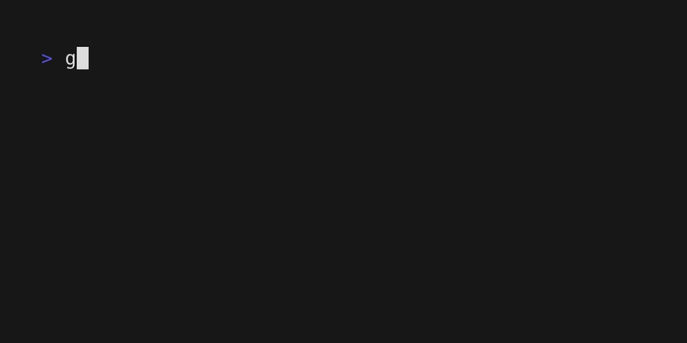

# Overview
**gopherden** is a command-line tool designed to simplify the management of multiple versions of the Go programming language. With **gopherden**, you can easily switch between different versions of Go installed on your system, install new versions, and uninstall old versions. This tool is perfect for developers who frequently work on projects that require different versions of Go or for those who want to keep their development environment up-to-date with the latest Go releases. **gopherden** is user-friendly and easy to install, making it an ideal choice for developers of all levels of experience.

## Installation

Install gopherden from github:

``` bash
curl -sLO https://github.com/SolarWolf-Code/gopherden/raw/master/gopherden && mkdir -p ~/bin && mv gopherden ~/bin/ && chmod +x ~/bin/gopherden && export PATH=$PATH:~/bin/
```
Requirements:
https://github.com/charmbracelet/gum/blob/main/README.md#Installation
## Usage
### How to install:


Each major release is sort from newest to oldest. Within each major release is a minor release including beta/rc versions. After install, the GOROOT will automatically change inside your .bashrc file. You may need to close and reopen your terminal for changes to take affect such as ```go version```. 
### How to uninstall:

Inside the path ~/.gopherden will contain each of the downloaded versions that you have downloaded using this tool. Choose the version you wish to uninstall and confirm.


### How to change Go version path

If you want to have more than one version of go installed, this is the best method to switch between them. Make sure to type it in correctly or it will not work. If the version has not been installed, a warning will display telling you.

I created this tool after using [gimme](https://github.com/travis-ci/gimme). Although that tool is miles in head of this project, I felt that it was lacking some features that I wanted such as displaying each version you can install, uninstall versions, and of course changing the path. All of these features are able to look pretty by using a lovely tool created by the [charmbracelet](https://github.com/charmbracelet/) team called [Gum](https://github.com/charmbracelet/gum)
#### NOTE:
Currently only works on **linux-amd64.tar.gz** go versions and using **bash**. Plans to support other versions and shells are planned.

